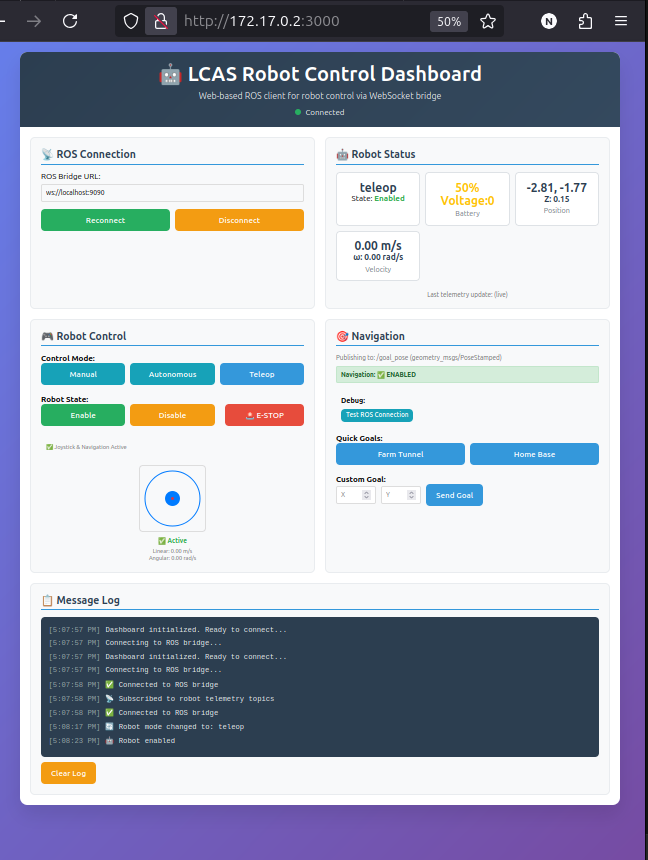

# Robot Control React App

[](https://reactjs.org/)
[](https://redux.js.org/)
[](https://www.ros.org/)
[](https://nodejs.org/)
[](https://developer.mozilla.org/en-US/docs/Web/JavaScript)

[](LICENSE)
[](package.json)
[](#)

This project is a React.js application that utilizes Redux for state management, roslib and rosbridge to control a robot. It provides a modern, responsive user interface for sending commands to the robot and monitoring its status with real-time updates.

## Screenshot


*Modern, responsive dashboard for real-time robot control and monitoring*

## ✨ Key Features

- 🎮 **Interactive Joystick Control** - Touch-friendly virtual joystick for robot movement
- 📊 **Real-time Status Monitoring** - Live updates of robot position, velocity, and battery
- 🗺️ **Navigation Goals** - Quick goal selection and custom coordinate navigation
- 📱 **Responsive Design** - Works seamlessly on desktop, tablet, and mobile devices
- 🔄 **Redux State Management** - Predictable state updates with Redux Toolkit
- 🌐 **ROS Integration** - Direct communication with ROS via rosbridge WebSocket
- 📝 **Message Logging** - Real-time log with filtering and timestamped entries
- 🛡️ **Safety Features** - Emergency stop and velocity limits
- ⚡ **Hot Reload** - Instant updates during development

## Table of Contents

- [Setup Instructions](#setup-instructions)
- [Project Structure](#project-structure)
- [Redux Architecture](#redux-architecture)
- [Components](#components)
- [Services](#services)
- [Utilities](#utilities)
- [Styling](#styling)
- [Usage](#usage)
- [Configuration](#configuration)
- [Development](#development)

## Setup Instructions

### Prerequisites

0. **Install NVM (Node Version Manager)**
    ```bash
    curl -o- https://raw.githubusercontent.com/nvm-sh/nvm/v0.39.1/install.sh | bash
    source ~/.bashrc
    ```

1. **Install Node.js**
    ```bash
    nvm install 18
    nvm use 18
    ```

### Installation

1. **Clone the Repository**:
   ```bash
   git clone <repository-url>
   cd robot-control-react-app
   ```

2. **Install Dependencies**:
   ```bash
   npm install
   ```

3. **Install Required Packages**:
   ```bash
   npm install roslib @reduxjs/toolkit react-redux
   ```

4. **Start ROS Bridge** (in separate terminal):
   ```bash
   # Option 1: Official ROS Bridge
   ros2 run rosbridge_server rosbridge_websocket
   ```

5. **Start Gazebo Simulator** (in separate terminal):
   ```bash
   ros2 launch limo_gazebosim limo_gazebo_diff.launch.py
   ```

6. **Start the React Application**:
   ```bash
   npm start
   ```

7. **Open in Browser**:
   ```bash
   "$BROWSER" http://localhost:3000
   ```

## Project Structure

The project follows a modern React architecture with Redux state management:

```
robot-control-react-app/
├── public/
│   ├── index.html
│   ├── favicon.ico
│   └── manifest.json
├── src/
│   ├── App.js                     # Main app component with Redux Provider
│   ├── App.css                    # Global styles and theme
│   ├── index.js                   # React app entry point
│   ├── index.css                  # Base CSS styles
│   │
│   ├── components/                # React components
│   │   ├── RobotController.js     # Main dashboard controller
│   │   ├── JoystickControl.js     # Virtual joystick component
│   │   ├── StatusDisplay.js       # Robot status panel
│   │   ├── NavigationPanel.js     # Navigation goals interface
│   │   └── MessageLog.js          # Real-time message log
│   │
│   ├── store/                     # Redux store configuration
│   │   ├── index.js               # Store configuration
│   │   ├── hooks.js               # Typed Redux hooks
│   │   │
│   │   ├── slices/                # Redux Toolkit slices
│   │   │   ├── connectionSlice.js # ROS connection state
│   │   │   ├── robotSlice.js      # Robot status & control state
│   │   │   ├── logsSlice.js       # Message logging state
│   │   │   └── navigationSlice.js # Navigation goals state
│   │   │
│   │   └── thunks/                # Async Redux actions
│   │       ├── connectionThunks.js # ROS connection operations
│   │       └── robotThunks.js     # Robot control operations
│   │
│   ├── services/                  # External service integrations
│   │   └── rosService.js          # ROS bridge communication
│   │
│   └── utils/                     # Utility functions and constants
│       └── constants.js           # Application configuration
│
├── package.json                   # Dependencies and scripts
├── package-lock.json             # Locked dependency versions
└── README.md                     # This file
```

## Redux Architecture

The application uses Redux Toolkit for predictable state management:

### State Structure
```javascript
{
  connection: {
    isConnected: boolean,
    connectionStatus: string,
    bridgeUrl: string,
    connectionError: string
  },
  robot: {
    status: { mode, battery, position, velocity, enabled },
    currentVelocity: { linear, angular },
    joystick: { isDragging, position, maxRadius },
    sensors: { laser, camera, imu },
    lastCommand: string
  },
  logs: {
    entries: Array<LogEntry>,
    maxEntries: number,
    filter: string
  },
  navigation: {
    currentGoal: Goal,
    goalHistory: Array<Goal>,
    quickGoals: Array<Goal>,
    customGoal: { x, y },
    navigationStatus: string
  }
}
```

### Key Actions
- `connectToRos()` - Establish ROS bridge connection
- `publishVelocity()` - Send robot velocity commands
- `stopRobot()` - Emergency stop functionality
- `addLogEntry()` - Add timestamped log messages
- `setCurrentGoal()` - Set navigation targets

## Components

### Core Components

- **RobotController**: Main dashboard component that orchestrates all panels and manages global state
- **JoystickControl**: Interactive virtual joystick with touch/mouse support for robot movement
- **StatusDisplay**: Real-time robot status display (mode, battery, position, velocity)
- **NavigationPanel**: Interface for setting navigation goals (quick goals and custom coordinates)
- **MessageLog**: Scrollable log with timestamped messages and filtering capabilities

### Component Features

- **Responsive Design**: Works on desktop, tablet, and mobile devices
- **Real-time Updates**: Live connection status and robot telemetry
- **Touch Support**: Mobile-friendly joystick controls
- **Error Handling**: Graceful degradation when ROS bridge is unavailable
- **Configuration Driven**: All limits and settings from centralized config

## Services

### rosService.js

Handles all ROS bridge communication:

```javascript
// Connection management
rosService.connect(bridgeUrl)
rosService.disconnect()

// Robot control
rosService.publishVelocity(linear, angular)
rosService.stopRobot()

// Status monitoring
rosService.isConnected
```

**Supported Features:**
- WebSocket connection to ROS bridge
- Velocity command publishing (`/cmd_vel` topic)
- Connection status monitoring
- Error handling and reconnection
- Fallback to simple Python bridge

## Utilities

### constants.js

Centralized configuration management:

```javascript
// ROS Configuration
ROS_CONFIG: { BRIDGE_URL, CMD_VEL_TOPIC, MESSAGE_TYPE }

// Robot Limits
VELOCITY_LIMITS: { LINEAR_MAX, ANGULAR_MAX, STEP }
ROBOT_CONFIG: { JOYSTICK_MAX_RADIUS, VELOCITY_THRESHOLD }

// Connection Settings
CONNECTION_CONFIG: { RETRY_INTERVAL, MAX_RETRY_TIME }

// UI Configuration
LOG_CONFIG: { MAX_ENTRIES, LEVELS }
NAVIGATION_CONFIG: { QUICK_GOALS, NAVIGATION_STATUSES }
```

## Styling

### Design System

- **Theme**: Modern gradient design with professional color scheme
- **Typography**: Apple system fonts with clear hierarchy
- **Layout**: CSS Grid for responsive dashboard layout
- **Animations**: Smooth transitions and hover effects
- **Icons**: Emoji-based icons for visual clarity

### Key Style Features

- **Gradient Backgrounds**: Modern visual appeal
- **Card-based Layout**: Clean separation of functionality
- **Responsive Grid**: Adapts to different screen sizes
- **Interactive Elements**: Hover effects and smooth transitions
- **Status Indicators**: Color-coded connection and status displays

## Usage

### Basic Operation

1. **Start the Application**: The dashboard initializes and attempts to connect to ROS bridge
2. **Monitor Connection**: Check the connection status indicator in the header
3. **Control Robot**: Use the virtual joystick to move the robot
4. **Set Goals**: Use quick goals or custom coordinates for navigation
5. **Monitor Status**: Watch real-time updates in the status panel
6. **View Logs**: Check the message log for system events and errors

### Emergency Features

- **E-STOP Button**: Immediately stops robot movement
- **Connection Monitoring**: Automatic reconnection attempts
- **Error Logging**: Detailed error messages in the log panel

## Configuration

### Environment Variables

The app supports different environments through configuration:

```javascript
// Development
BRIDGE_URL: 'ws://localhost:9090'

// Production  
BRIDGE_URL: 'wss://your-robot.com:9090'
```

### Velocity Limits

Configurable safety limits:

```javascript
VELOCITY_LIMITS: {
  LINEAR_MAX: 2.0,    // m/s
  ANGULAR_MAX: 1.2,   // rad/s
  STEP: 0.2           // increment
}
```

## Development

### Available Scripts

```bash
# Development
npm start           # Start development server
npm test            # Run test suite
npm run build       # Build for production

# Linting
npm run lint        # Check code style
npm run lint:fix    # Fix code style issues
```

### Development Tools

- **Redux DevTools**: Time-travel debugging
- **React Developer Tools**: Component inspection
- **Hot Reload**: Instant updates during development

### Testing ROS Integration

1. **Start Gazebo**: `ros2 launch limo_gazebosim limo_gazebo_diff.launch.py`
2. **Launch ROS Bridge**: `ros2 launch rosbridge_server rosbridge_websocket_launch.xml`
2. **Start ROS Bridge**: `ros2 run rosbridge_server rosbridge_websocket`
3. **Test Commands**: Use joystick to verify robot movement
4. **Check Topics**: `ros2 topic list` to verify `/cmd_vel`, `/goal_pose` publishing

### Troubleshooting

**Connection Issues:**
- Verify ROS bridge is running on port 9090
- Check firewall settings
- Ensure rosbridge_server package is installed

**Performance:**
- Monitor Redux DevTools for unnecessary re-renders
- Check browser console for WebSocket errors
- Verify robot is receiving commands: `ros2 topic echo /cmd_vel`

---

## 📄 License

[](LICENSE)
[](#development)

Open Source

---

## 👥 Author

**LCAS Robotics Team**
- 🏛️ Organization: Lincoln Centre for Autonomous Systems (LCAS)
- 🌐 Website: [https://lcas.lincoln.ac.uk/](https://lcas.lincoln.ac.uk/)
- 📧 Contact: [lcas@lincoln.ac.uk](mailto:lcas@lincoln.ac.uk)

---

*Built with ❤️ for the robotics community*